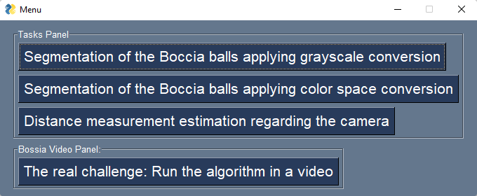

Instructions for test of first project - Computational Vision:

The developed project allows to execute from menu.py (which refers to the menu itself), but also from each one of the four modules.

- Running it from menu, the following window should open:

- When one of the four buttons is selected, a new python file (linked to the option) is executed, and the output results are drained to a new GUI. When it finishes, the window should appear.

- Each one of the four windows contains a button named "Back" that allows us to return back to the menu, and then select another option if we want to.

- As we can see, each of the four functionalities require user input.
    - *For the first one, three parameters are requested:*
        - ## Base folder name ## - [CVis_2223_Assign1_MarcoGameiro]
        - ## Source image filename ## - [Boccia_balls.jpg]
        - ## Reference image filename for dice coefficient computing ## - [Boccia_balls_GT.jpg]

            [.../first_part.py ...]

    - *For the second one, three parameters are requested:*
        - ## Base folder name ## - [CVis_2223_Assign1_MarcoGameiro]
        - ## Source HSV image filename ## - [hsv_image.png]
        - ## Reference image filename for dice coefficient computing ## - [Boccia_balls_GT.jpg]

            [.../second_part.py ...]

    - *For the third one, three parameters are requested:*
        - ## Full path to the image file ## - [C:/VisComp/PL/Project/CVis_2223_Assign1_MarcoGameiro/data/Boccia_balls.jpg]   
        - ## Distance from red ball to camera ## - [40]
        - ## Diameter, in real units (cm) of red ball ## - [8.2]

            [.../third_part.py ...]

    - *For the fourth and last one:*        
        - ## Initial video filename ## - [.../Boccia_video.avi]    
        - ## Final video filename ## - [.../Boccia_output_video.avi]          
        - ## Distance from red ball to camera ## - [40]
        - ## Diameter, in real units (cm) of red ball ## - [8.2]
        - ## Excel filename (without extension) ## - [data_project_VC]      

            [.../dists_video.py ...]

- If we want to execute each one of the modules separately, we can do it by the command line ([[pythonFile] [parameters]])

